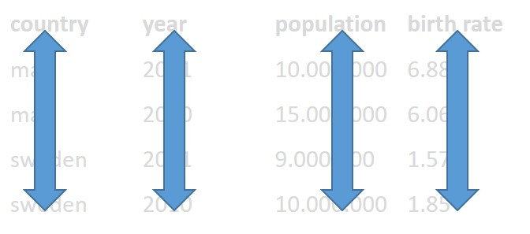
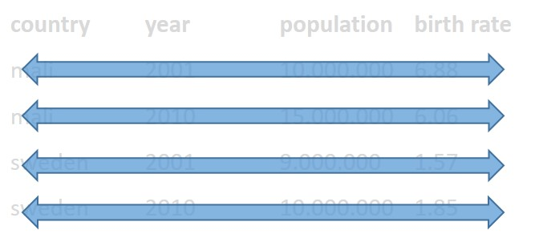
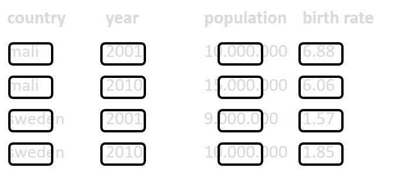

# Primer to R for data science

```{r setup, include=FALSE}
knitr::opts_chunk$set(echo = TRUE)
```


## The _GUI problem_

Most people would agree that this seems to be a good practice. However, many people use GUI based software (graphical user interface). Citing Wikipedia, this is a *"user interface that allows users to interact with electronic devices through graphical icons and audio indicator such as primary notation, instead of text-based user interfaces, typed command labels or text navigation."* So basically, any program that you use by clicking around in menu's, or using voice control etc, for data science this could for instance be Excel.

However, how would you 'describe' the steps of an analysis or creation of a graph when you use GUI based software? 

```{r messysteps, dpi = 80, echo=F}
knitr::include_graphics(
  file.path(
    "images/messy_steps.jpg"
  )
)
```

<p style="font-size:14px">**The file "./Rmd/steps_to_graph_from_excel_file.html" shows you how to do this using the programming language R.</p>

Maybe ~~videotape~~ tiktok-record your process and add .mp4 to your paper? Type out every step in a Word document? Both options seem rather silly. This is actually really hard!

This is why so many researchers are using code to analyse their data. If you do, just make sure you keep the code with the data. If you don't, make sure you precisely keep track of every step you take, in a separate text document.


## Tidy data

Tidy data is a way of organising your data in a neat and structured way. If you make your data tidy, it is ensured that it is machine readable. This is important in ONTOX, as we want to use the data to build an AI platform.

So what is tidy data:

1. Each variable must have its own column.  
1. Each observation must have its own row. 
1. Each value must have its own cell.

*Table1: Example of tidy data*

| country 	| year 	| population 	| birth rate 	|
|:---------	|:-----	|:----------	|:-----------	|
| mali    	| 2001 	| 10.000.000 	| 6.88       	|
| mali    	| 2010 	| 15.000.000 	| 6.06       	|
| sweden  	| 2001 	| 9.000.000  	| 1.57       	|
| sweden  	| 2010 	| 10.000.000 	| 1.85       	|


Each variable must have its own column.  

```{r , echo=FALSE, message=FALSE, out.width = "60%"}

```

Each observation must have its own row. 

```{r , echo=FALSE, message=FALSE, out.width = "60%"}

```

Each value must have its own cell.

```{r , echo=FALSE, message=FALSE, out.width = "60%"}

```

So the following table would by untidy, as there are multiple observations per row:

*Table2: Example of untidy data*

| participant  	| sample1 	| sample2 	| sample3 	| sample4 	|
|:----------	|:------	|:--------	|:-------------	|:-----	|
| Pietje   	| 7.5  	| 6      	| 8.2         	| 8   	|
| Marietje 	| 8    	| 7.9    	| 5           	| 9   	|


This would be the tidy version:

*Table3: Example of untidy data made tidy*

| student  	| sample      	| stairs_walked 	|
|:----------	|:-------------	|:-------	|
| Pietje   	| 1        	| 7.5   	|
| Pietje   	| 2      	| 6     	|
| Pietje   	| 3 	| 8.2   	|
| Pietje   	| 4         	| 8     	|
| Marietje 	| 1        	| 8     	|
| Marietje 	| 2      	| 7.9   	|
| Marietje 	| 3 	| 5     	|
| Marietje 	| 4         	| 9     	|


