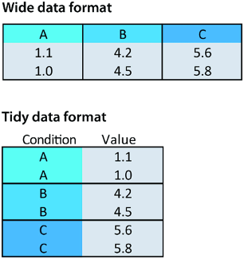

```{r setup, include=FALSE}
knitr::opts_chunk$set(echo = TRUE)
```

## machine readable data

```{r, echo = FALSE, out.width=780, fig.cap="this needs AI readable data"}
knitr::include_graphics(
  here::here(
    "images",
    "ontox_overview.jpeg"
    )
)
```

## machine readable data

```{r, echo = FALSE, out.width=780, fig.cap="Excel is hard for machines"}
knitr::include_graphics(
  here::here(
    "images",
    "bad_excel.png"
    )
)
```

## Tidy data



Wide vs long (tidy) data

Mice in 3 groups: 

A B en C
length of left front paw in cm

Use sensible variable names and include units 

## Tidy data

```{r, echo = FALSE, out.width=680, fig.cap=""}
knitr::include_graphics(
  here::here(
    "images",
    "tidy2.png"
    )
)
```

## Tidy data

 - Each variable its own column. No duplicate columns. Each observation its own row. Each value must have its own cell.
 - One datatype per column, be consistent
 - notes in a separate column
 - don’t use formatting to convey information

## Reproducible tidy data

 - never throw away or change a raw datafile. Raw data = however YOU received the data, be it from a machine, handmade in Excel yourself, or received through email.
 - data always needs meta data
 - keep data with the interpretation in one project folder.

## Now what about all the rest?

Projects are not just data

## Version control

Which of these issues can you relate to?

 - I can’t remake this figure from last year
 - I slightly modified my code in one place, everything stopped working
 - I have several copies of the same directory because I’m worried about breaking something
 - Somebody added erroneous records in a shared file with samples, cannot find who and why
 - I have to merge changes to our manuscript from 10 different emails with collaborators
 - I came to an old project and forgot where I left/saved it
 - My directory is polluted with a lot of unused/temporary/old folders because I’m afraid of losing something important

source: [Source: FAIR in (biological) practice.  ](https://carpentries-incubator.github.io/fair-bio-practice/11-version-control/index.html) Licensed under [CC-BY 4.0](https://creativecommons.org/licenses/by/4.0/) 2022.

## Changing a file: 

 - overwrite old content or loose whole files
 - may break connections
 - may need to merge changes from collaborators

Addressing those issues by tracking changes is called version control.

Information about versions and changes are kept separate from the files.

## Version control

```{r, echo = FALSE, out.width=610, fig.cap=""}
knitr::include_graphics(
  here::here(
    "images",
    "version1.png"
    )
)
```

## Version control

```{r, echo = FALSE, out.width=610, fig.cap=""}
knitr::include_graphics(
  here::here(
    "images",
    "version2.png"
    )
)
```


## Exercises regular

 - B3: learn to make data tidy
 - B4: evaluate your version control
 - B5: visualise your data workflow to find your needs for version control

## Exercises next level

 - C5: visualise your data workflow to find your needs for version control
 - C4: visualise them with `mermaid`

## Location

Breakout rooms, groups of 5

back here at ca 18:10 to discuss your training needs for the coming year.


